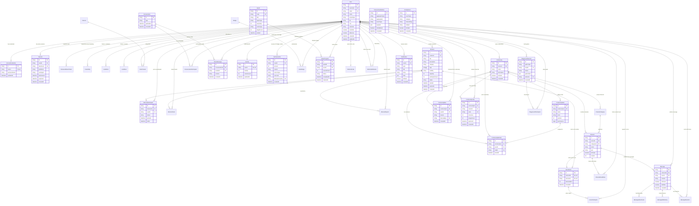

# NEXUS Database Entity-Relationship Diagram (ERD)

This document maps all core entity relationships, cardinality, and foreign key cascades for the clean PostgreSQL 16 schema.

```mermaid
erDiagram
    %% ==========================================
    %% 1. IDENTITY & SESSIONS
    %% ==========================================
    User ||--o| AccountCredential : "has credentials"
    User ||--o{ Session : "has active sessions"
    User ||--o{ PasswordResetToken : "requests reset"

    %% ==========================================
    %% 2. SOCIAL GRAPH & PRIVACY
    %% ==========================================
    User ||--o{ Friendship : "requests/receives friendship"
    User ||--o{ UserBlock : "blocks / is blocked"
    User ||--o{ UserMute : "mutes / is muted"

    %% ==========================================
    %% 3. INTERESTS & RADAR
    %% ==========================================
    User ||--o{ UserInterest : "subscribes to"
    Interest ||--o{ UserInterest : "categorizes"

    %% ==========================================
    %% 4. MOMENTS ENGINE
    %% ==========================================
    User ||--o{ Moment : "creates moments"
    Moment ||--o{ MomentParticipant : "contains participants"
    User ||--o{ MomentParticipant : "joins as participant"
    Moment ||--o{ MomentInvite : "generates invites"
    User ||--o{ MomentInvite : "invites friends"
    Moment ||--o{ MomentReport : "reported by"
    User ||--o{ MomentReport : "submits report"

    %% ==========================================
    %% 5. COMMUNITIES & CHAT
    %% ==========================================
    User ||--o{ Community : "owns communities"
    Community ||--o{ CommunityMember : "has members"
    User ||--o{ CommunityMember : "joins community"
    Community ||--o{ CommunityRole : "defines roles"
    CommunityRole ||--o{ CommunityMember : "assigned to"
    Community ||--o{ CommunityBan : "bans user"
    User ||--o{ CommunityBan : "is banned from community"
    Community ||--o{ CommunityInvite : "has invite links"
    User ||--o{ CommunityInvite : "creates invite link"
    Community ||--o{ ChannelCategory : "groups channels"
    Community ||--o{ Channel : "contains channels"
    ChannelCategory ||--o{ Channel : "organizes"
    Channel ||--o{ Message : "contains text messages"
    User ||--o{ Message : "authors message"
    Message ||--o{ MessageAttachment : "has files/media"
    Message ||--o{ MessageEditHistory : "tracks revisions"
    Message ||--o{ MessageReaction : "has reactions"
    User ||--o{ MessageReaction : "reacts with emoji"
    Channel ||--o{ ChannelReadState : "tracks read states"
    User ||--o{ ChannelReadState : "tracks unread count"

    %% ==========================================
    %% 6. DIRECT MESSAGING (DMs)
    %% ==========================================
    Conversation ||--o{ ConversationParticipant : "has participants"
    User ||--o{ ConversationParticipant : "participates in DM"
    Conversation ||--o{ DirectMessage : "contains DMs"
    User ||--o{ DirectMessage : "sends direct message"

    %% ==========================================
    %% 7. GAMIFICATION & QUESTS
    %% ==========================================
    User ||--o| UserXp : "holds total XP"
    User ||--o{ XpTransaction : "receives XP ledger entries"
    Badge ||--o{ UserBadge : "unlocked as"
    User ||--o{ UserBadge : "displays badge"
    Quest ||--o{ QuestProgress : "evaluates progress"
    User ||--o{ QuestProgress : "tracks quest"

    %% ==========================================
    %% 8. REFERRAL GROWTH LOOP
    %% ==========================================
    User ||--o| ReferralCode : "owns invite code"
    User ||--o{ ReferralAttribution : "refers new users"
    User ||--o| ReferralAttribution : "referred by"

    %% ==========================================
    %% 9. SOCIAL PLAYGROUND & VOICE
    %% ==========================================
    User ||--o{ PlaygroundSession : "hosts games"
    PlaygroundSession ||--o{ PlaygroundParticipant : "has players"
    User ||--o{ PlaygroundParticipant : "plays game"
    Channel ||--o| VoiceRoom : "hosts voice room"
    Moment ||--o| VoiceRoom : "hosts voice activity"
    VoiceRoom ||--o{ VoiceParticipant : "active callers"
    User ||--o{ VoiceParticipant : "speaks in voice"

    %% ==========================================
    %% 10. NOTIFICATIONS
    %% ==========================================
    User ||--o{ Notification : "receives alerts"

    %% ==========================================
    %% ENTITY DETAILS
    %% ==========================================
    User {
        string id PK
        string username UK
        string email UK
        string name
        string avatarStyle
        string bio
        string role
        string roleColor
        boolean isVerified
        boolean isBanned
        datetime createdAt
        datetime updatedAt
    }

    AccountCredential {
        string id PK
        string userId FK,UK
        string passwordHash
        datetime updatedAt
    }

    Session {
        string id PK
        string userId FK
        string tokenHash UK
        string ipAddress
        string userAgent
        datetime lastActiveAt
        datetime expiresAt
        datetime createdAt
    }

    Moment {
        string id PK
        string creatorId FK
        string title
        string description
        string category
        string[] tags
        string visibility
        int capacity
        int participantCount
        string status
        datetime startsAt
        datetime expiresAt
        datetime createdAt
    }

    MomentParticipant {
        string id PK
        string momentId FK
        string userId FK
        string status
        datetime joinedAt
        datetime leftAt
    }

    Community {
        string id PK
        string ownerId FK
        string name
        string description
        boolean isPublic
        datetime createdAt
    }

    CommunityRole {
        string id PK
        string communityId FK
        string name
        string color
        int position
        bigint permissions
    }

    CommunityMember {
        string id PK
        string communityId FK
        string userId FK
        string roleId FK
        datetime joinedAt
    }

    CommunityBan {
        string id PK
        string communityId FK
        string userId FK
        string reason
        string bannedById FK
        datetime createdAt
    }

    CommunityInvite {
        string id PK
        string communityId FK
        string inviterId FK
        string code UK
        int maxUses
        int usageCount
        datetime expiresAt
        datetime createdAt
    }

    Channel {
        string id PK
        string serverId FK
        string categoryId FK
        string name
        string type
        boolean isPrivate
        int position
    }

    Message {
        string id PK
        string channelId FK
        string userId FK
        string content
        boolean isPinned
        boolean isEdited
        datetime createdAt
    }

    Conversation {
        string id PK
        string type
        datetime updatedAt
        datetime createdAt
    }

    DirectMessage {
        string id PK
        string conversationId FK
        string senderId FK
        string content
        datetime createdAt
    }

    UserXp {
        string id PK
        string userId FK,UK
        int totalXp
        int currentLevel
        datetime updatedAt
    }

    XpTransaction {
        string id PK
        string userId FK
        int amount
        string reason
        string sourceType
        string sourceId
        string idempotencyKey UK
        datetime createdAt
    }

    Quest {
        string id PK
        string code UK
        string title
        string questType
        int rewardXp
        string actionType
        int targetCount
        datetime endsAt
    }

    QuestProgress {
        string id PK
        string questId FK
        string userId FK
        int currentCount
        string status
        datetime completedAt
        datetime claimedAt
    }

    PlaygroundSession {
        string id PK
        string gameType
        string hostId FK
        string status
        json gameState
        string winnerId FK
        datetime createdAt
    }

    VoiceRoom {
        string id PK
        string channelId FK,UK
        string momentId FK,UK
        int activeCallers
        datetime createdAt
    }

    Notification {
        string id PK
        string userId FK
        string type
        string title
        string body
        json data
        boolean isRead
        datetime createdAt
    }

    TransactionalOutbox {
        string id PK
        string aggregateType
        string aggregateId
        string eventType
        json payload
        boolean isPublished
        datetime createdAt
    }

    ActivityEvent {
        string id PK
        string eventType
        string category
        string interestSlug
        string entityId
        boolean isPublic
        datetime createdAt
    }
```
